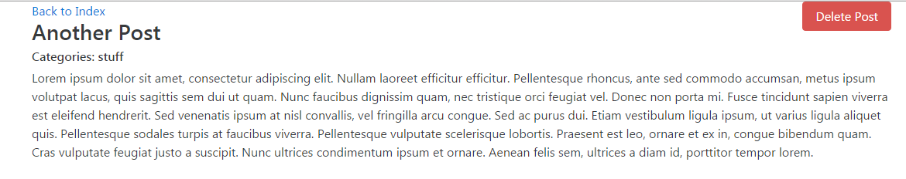

# React/Redux Blog App Demo

Demo project created from Udemy course Modern React with Redux by Stephen Grider

*  Uses redux-form

Screen for listing posts:

Screen for adding posts

Screen showing post details

